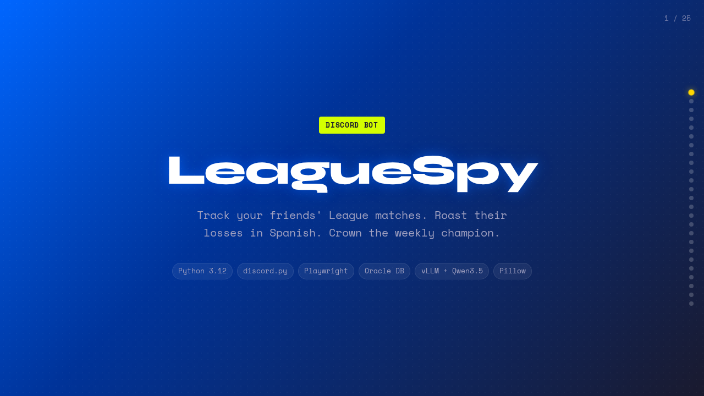
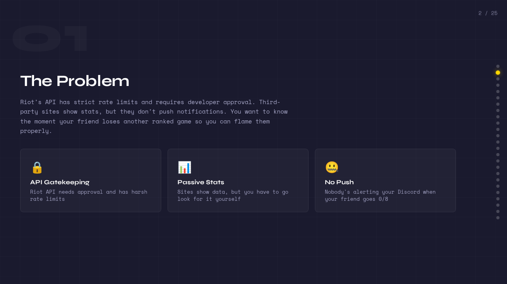
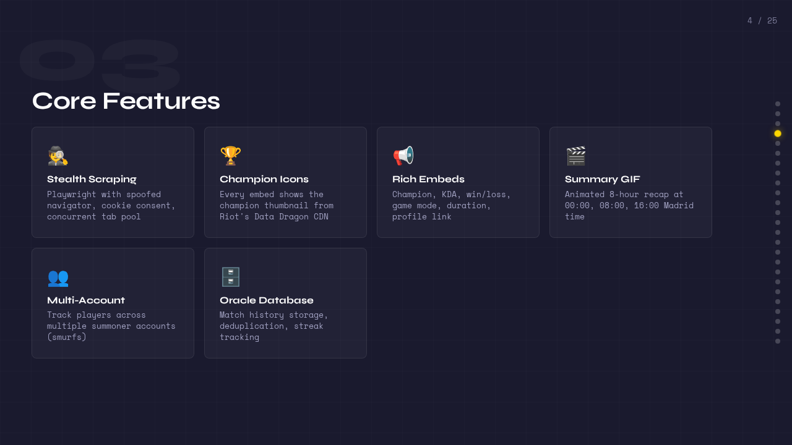
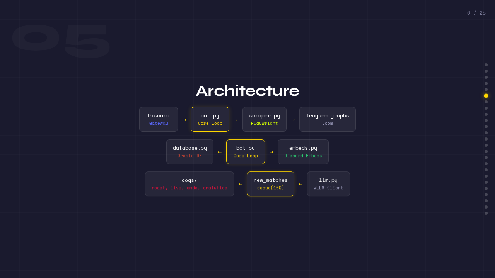
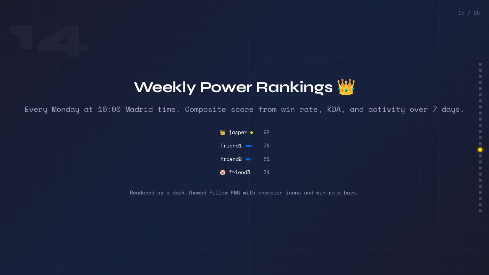
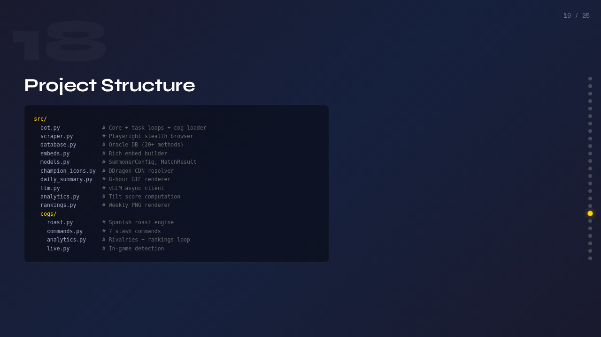
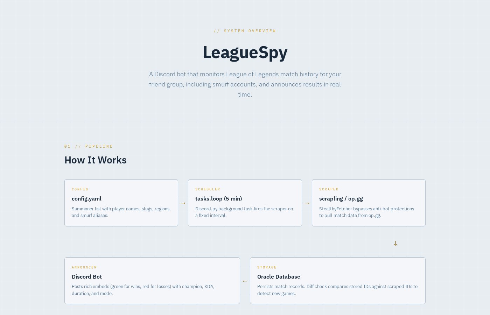
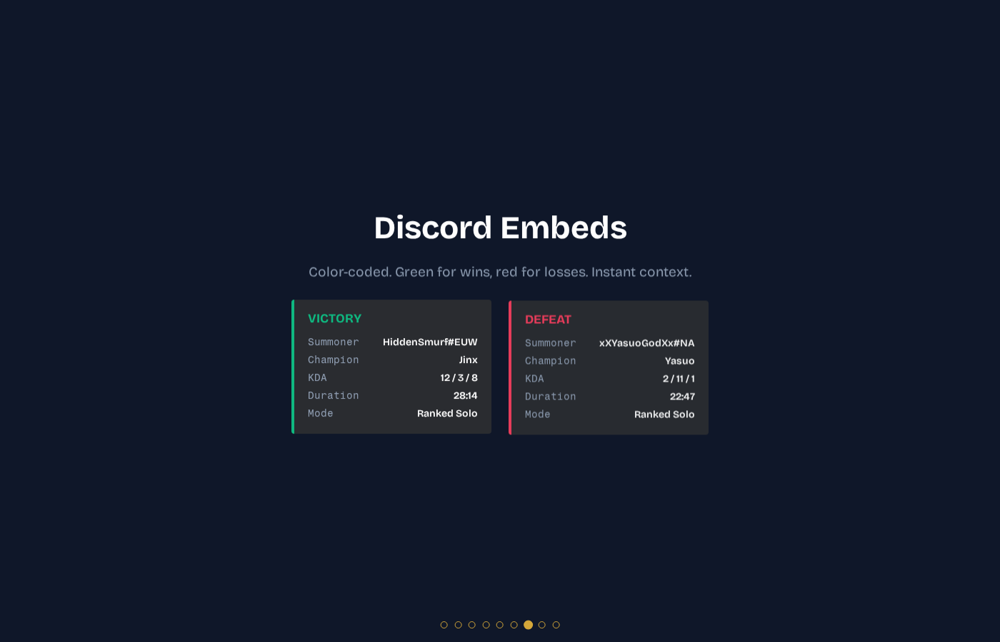
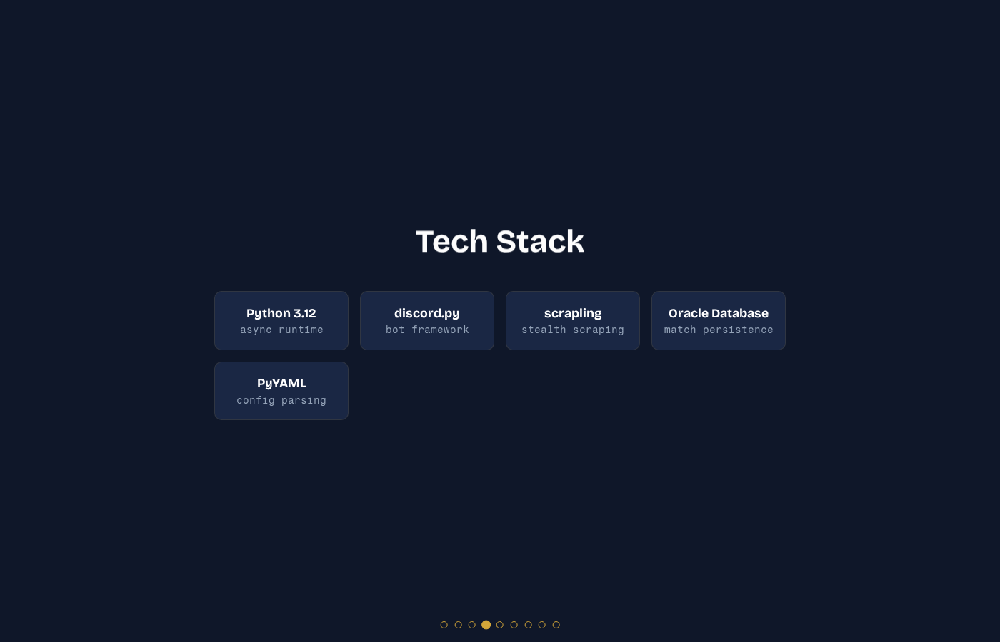

<div align="center">

# LeagueSpy

<p align="center"><b>Track your friends' League matches. Roast their losses in Spanish. Crown the weekly champion.</b></p>

[](https://www.python.org/downloads/)
[](https://www.oracle.com/database/free/)
[](https://discordpy.readthedocs.io/)
[](https://playwright.dev/)
[](https://docs.vllm.ai/)
[](https://python-pillow.org/)
[](LICENSE)
[](#running-tests)

</div>

<div align="center">

**[View Interactive Presentation](docs/slides/presentation.html)** | Animated overview of the project

</div>

<table>
<tr>
<td></td>
<td></td>
</tr>
<tr>
<td></td>
<td></td>
</tr>
<tr>
<td></td>
<td></td>
</tr>
</table>

Discord bot that scrapes [leagueofgraphs.com](https://www.leagueofgraphs.com) for League of Legends match history and announces new games in your server. Tracks multiple players and their smurf accounts, roasts losses in Spanish via a local LLM, detects rivalries, computes tilt scores, and posts weekly power rankings.



## One-Command Install

```bash
curl -fsSL https://raw.githubusercontent.com/jasperan/LeagueSpy/main/install.sh | bash
```

That clones the repo, creates a **Conda env if Conda is installed** (otherwise a local `.venv`), installs Python deps, installs Playwright Chromium, and runs an offline preflight check. You'll just need to fill in `config.yaml`, set up Oracle DB, and start vLLM if you want the roast engine.

<details><summary>Override install location</summary>

```bash
PROJECT_DIR=/opt/leaguespy curl -fsSL https://raw.githubusercontent.com/jasperan/LeagueSpy/main/install.sh | bash
```

</details>

## Features

### Core
- **Stealth scraping** via Playwright with bot-detection evasion (spoofed navigator, cookie consent handling, concurrent tab pool)
- **Champion icon thumbnails** on every match embed, pulled from Riot's [Data Dragon CDN](https://developer.riotgames.com/docs/lol#data-dragon)
- **Rich Discord embeds** with champion, KDA, win/loss, game mode, duration, and profile link
- **Interactive match cards** with one-click Ask, Roast, Analyze, Trends, and Profile actions on every announcement
- **Daily summary image/GIF** sent at midnight Madrid time, with per-player cards, social awards, and auto-posted trend charts for active players
- **Multi-account tracking** for players with multiple summoner accounts (smurfs)
- **Oracle Database** storage for match history and deduplication
- **Configurable polling** interval (default: 5 minutes)
- **Preflight doctor + offline showcase** so you can validate config, dependencies, Playwright, and visual output before wiring Discord/Oracle/vLLM
- **Per-summoner region** support (EUW, NA, KR, etc.)

### Spanish Roast Engine (v2)
- **Auto-roasts on every loss** via vLLM + Qwen3.5:9B with thinking mode disabled. Fast, local, zero API costs.
- **Escalating intensity**: mild jabs on single losses, maximum savagery on 3+ loss streaks, special triggers for 0-kill games
- **Backhanded compliments** on perfect KDA games ("seguro los rivales eran bots")
- **Deduplication**: stores roast history in Oracle DB, feeds last 5 roasts to the LLM with "no repitas" so it never repeats itself

### Slash Commands (v2)
- `/spy add <slug> <name> [region]` -- add a summoner to tracking without editing config
- `/spy setup` -- open a guided Discord form to add a summoner
- `/spy remove <slug>` -- stop tracking a summoner
- `/spy stats [player]` -- on-demand stats card (W/L, streak, KDA, tilt score)
- `/spy leaderboard` -- group rankings sorted by win rate (min 10 games)
- `/spy roster` -- show tracked players, summoner slugs, regions, and profile links
- `/spy roast <player>` -- on-demand LLM roast using recent match history
- `/spy champions <player>` -- champion mastery breakdown (top 10, win rates, avg KDA)
- `/spy trends <player>` -- performance chart over recent games
- `/spy ask <question>` -- natural-language Q&A over tracked player data
- `/spy health` -- runtime health snapshot for the browser, DB, LLM config, and tracked players
- `/spy help` -- in-Discord command reference
- `/spy h2h <player1> <player2>` -- head-to-head record with last 5 encounters

Player and summoner arguments autocomplete from the currently tracked roster, so users do not need to memorize exact names or slugs.

### Analytics (v2)
- **Tilt score** (0-100): composite metric from loss streak, KDA decay, death rate, and surrender frequency. Shown in `/spy stats` and fed to the roast engine for maximum accuracy.
- **Weekly power rankings**: Pillow-rendered PNG posted every Monday at 10:00 Madrid time. Crown for #1, clown for last place.
- **Rivalry auto-detection**: when two tracked players appear in the same match on opposite teams, the bot posts a special rivalry embed with the all-time head-to-head record

### Live Game Alerts (v2)
- **In-game detection**: polls summoner profiles every 2 minutes for the "currently playing" indicator
- **Blue alert embeds** when someone starts a game, with champion icon if detectable
- **No duplicate alerts**: state tracked in Oracle DB, cleared when the game ends

## Discord Embed Preview



Green sidebar for wins. Red for losses. Each embed shows the champion icon and links to the player's leagueofgraphs profile.

## Prerequisites

- Python 3.12+
- [Conda](https://docs.conda.io/) (recommended) or virtualenv
- [vLLM](https://docs.vllm.ai/) serving Qwen3.5:9B (for the roast engine; optional, bot works without it)
- Oracle Database (Free tier works fine)
- Discord bot token ([create one here](https://discord.com/developers/applications))

## Manual Setup

**1. Clone and create environment**

```bash
git clone https://github.com/jasperan/LeagueSpy.git
cd LeagueSpy
conda create -n leaguespy python=3.12 -y
conda activate leaguespy
pip install -r requirements.txt
playwright install chromium
```

<details><summary>No Conda? Use a virtualenv instead</summary>

```bash
git clone https://github.com/jasperan/LeagueSpy.git
cd LeagueSpy
python3 -m venv .venv
source .venv/bin/activate
python -m pip install --upgrade pip
pip install -r requirements.txt
python -m playwright install chromium
```

</details>

**2. Set up Oracle Database**

Create the `leaguespy` user in your Oracle instance, then run the schema:

```bash
sqlplus leaguespy/leaguespy@localhost:1523/FREEPDB1 @scripts/setup_db.sql
sqlplus leaguespy/leaguespy@localhost:1523/FREEPDB1 @scripts/migrate_v2.sql
```

**3. Start vLLM (optional, for roast engine)**

```bash
vllm serve Qwen/Qwen3.5-9B --port 8000
```

The bot works without vLLM. The roast engine just stays silent if the endpoint is unavailable.

**Tip:** `config.yaml` also supports environment placeholders like `${DISCORD_BOT_TOKEN}` and `${LEAGUESPY_DSN:-localhost:1523/FREEPDB1}` if you prefer not to hard-code secrets.

**4. Configure**

```bash
cp config.example.yaml config.yaml
```

Fill in your Discord bot token, channel ID, and summoner list:

```yaml
discord:
  token: "YOUR_DISCORD_BOT_TOKEN"
  channel_id: 0  # Right-click channel -> Copy ID

oracle:
  user: "leaguespy"
  password: "leaguespy"
  dsn: "localhost:1523/FREEPDB1"

scraping:
  interval_minutes: 5
  live_check_minutes: 2
  region: "euw"

llm:
  base_url: "http://localhost:8000/v1"
  model: "qwen3.5:9b"
  max_tokens: 200

features:
  roast: true
  analytics: true
  match_actions: true
  live_alerts: true
  slash_commands: true

players:
  - name: "jasper"
    summoners:
      - slug: "jasper-1971"
        region: "euw"
```

Enable Developer Mode in Discord settings to copy channel IDs. Set any `features` flag to `false` to disable that module.

**5. Validate config + run the preflight doctor**

```bash
python -m src.bot --check-config --config config.yaml
python -m src.cli doctor --config config.yaml --offline
```

The first command performs a strict runtime config check. The second validates the config shape, confirms your Python deps are importable, and checks that Playwright Chromium is installed before you try the full stack.

**6. Run**

```bash
python -m src.bot --config config.yaml
```

## Adding Players and Smurfs

Each player can have multiple summoner accounts:

```yaml
players:
  - name: "jasper"
    summoners:
      - slug: "jasper-1971"
        region: "euw"
      - slug: "smurf-account-1234"
        region: "euw"
  - name: "friend1"
    summoners:
      - slug: "friend1-tag"
        region: "na"
```

The `slug` is the URL-safe summoner identifier from leagueofgraphs. Go to `leagueofgraphs.com/summoner/{region}/{slug}` to find yours.

You can also add players at runtime with `/spy add <slug> <name> [region]` without editing the config file.

## How It Works



**Match tracking:** Every 5 minutes, the bot scrapes each summoner's leagueofgraphs profile using a stealth Playwright browser (3 concurrent tabs). New match IDs get stored in Oracle DB and announced via Discord embed. Already-seen matches are skipped. When `features.match_actions` is enabled, each announcement also gets Discord buttons for Ask, Roast, Analyze, Trends, and Profile so the group can keep interacting with a match after it posts.

**Roast engine:** After each match announcement, the roast cog checks the result. Losses trigger a Spanish roast via vLLM + Qwen3.5:9B. The roast intensity scales with the player's current loss streak and tilt score. Perfect KDA games get backhanded compliments. The LLM receives the last 5 roasts for that player so it doesn't repeat itself.

**Live alerts:** Every 2 minutes, the bot checks each summoner's profile for the "currently in game" indicator. When someone starts a game, a blue embed goes out with their champion (if detectable). When the game ends, the state resets automatically.

**Rivalry detection:** When a new match is inserted, the bot checks if another tracked player shares the same match ID with the opposite win value. If so, a purple "RIVALIDAD DETECTADA" embed fires with the all-time head-to-head record.

**Daily summary:** At midnight Madrid time, the bot queries all matches from the last 24 hours, groups them by player, renders a composite summary image (or GIF for larger groups), and sends it to the channel with deterministic awards like MVP, Tilt Watch, Cleanest Game, Grinder, and Vision Lead. Players with zero matches in the window are skipped.

**Weekly power rankings:** Every Monday at 10:00 Madrid time, the bot computes a composite score (win rate, KDA, activity) for each player over the last 7 days and renders a ranked PNG. Crown emoji for #1, clown emoji for last place.

## Project Structure

```
src/
  bot.py             # Bot core with task loops (matches + summary), cog loader
  cli.py             # User-facing utility commands (doctor + showcase)
  config.py          # Shared config validation, env interpolation, and reporting helpers
  doctor.py          # Preflight checks for config, deps, Playwright, Oracle, and vLLM
  scraper.py         # leagueofgraphs scraper (Playwright stealth browser)
  database.py        # Oracle DB layer (oracledb) with 20+ query methods
  awards.py          # Daily social awards from stored match data
  embeds.py          # Discord rich embed builder with champion thumbnails
  match_actions.py   # Interactive Ask/Roast/Analyze/Trends/Profile buttons for match cards
  models.py          # Data models (SummonerConfig, MatchResult)
  champion_icons.py  # Riot DDragon CDN icon resolution and caching
  daily_summary.py   # Daily summary image/GIF renderer (Pillow)
  llm.py             # vLLM async client (OpenAI-compatible API)
  analytics.py       # Tilt score computation
  rankings.py        # Weekly power rankings Pillow renderer
  showcase.py        # Offline artifact generator for walkthroughs and smoke tests
  sample_data.py     # Bundled fixture-like sample data for showcase/demo flows
  cogs/
    roast.py         # Spanish roast engine (loss triggers, streak escalation)
    commands.py      # /spy command surface (tracking, trends, ask, health, help, h2h, more)
    analytics.py     # Rivalry detection + weekly rankings task loop
    live.py          # In-game detection alerts
scripts/
  readme_walkthrough.sh  # README-style smoke run: doctor + showcase + full pytest
  setup_db.sql       # Oracle schema v1 (sequences + tables)
  migrate_v2.sql     # v2 migration (streaks, live_games, roast_history)
tests/               # 261 unit and integration tests
assets/
  visual-explainer.html  # Interactive architecture diagram
  slides.html            # Presentation deck
```

## Offline Smoke Walkthrough

If you want to validate the repo the way a README-reader would (without Discord credentials, Oracle, or a live vLLM server), run:

```bash
./scripts/readme_walkthrough.sh
```

That will:

1. Run `python -m src.cli doctor --config config.example.yaml --offline`
2. Generate offline showcase artifacts (scoreboard, summary image, daily awards, trend chart, rankings, sample announcement JSON with action metadata)
3. Run the full pytest suite

You can also run the showcase directly:

```bash
python -m src.cli showcase --output-dir /tmp/leaguespy-showcase
```

## Running Tests

```bash
pytest tests/ -v
```

274 tests covering the scraper, database, embeds, interactive match actions, daily awards, champion icons, summary rendering, scheduler logic, config validation, bot CLI checks, preflight doctor, showcase generation, demo wrappers, vLLM client, roast engine, slash commands, setup modal flow, slash command autocomplete, roster display, tilt score, power rankings, analytics cog, and live game alerts.

## License

MIT
